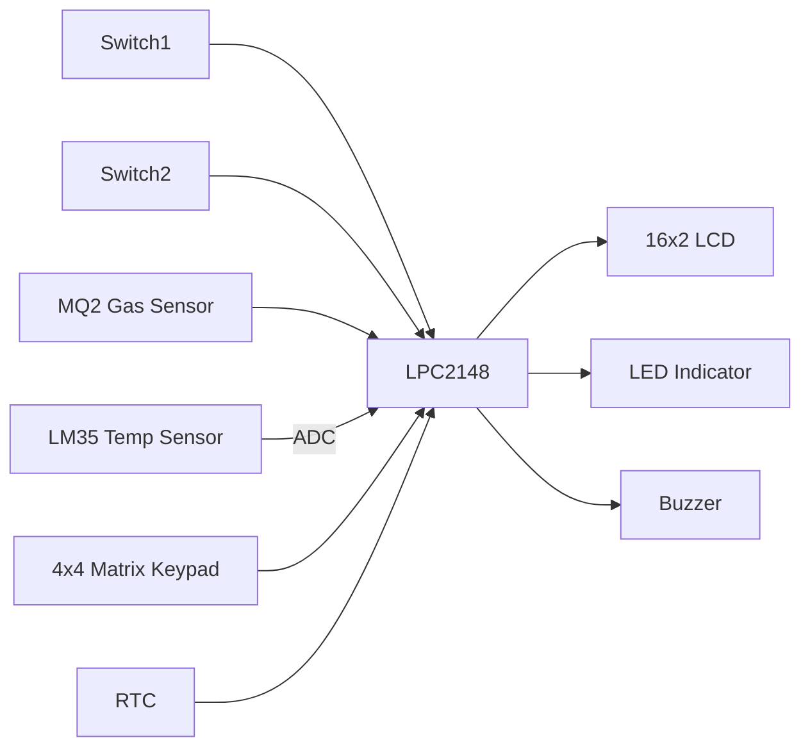
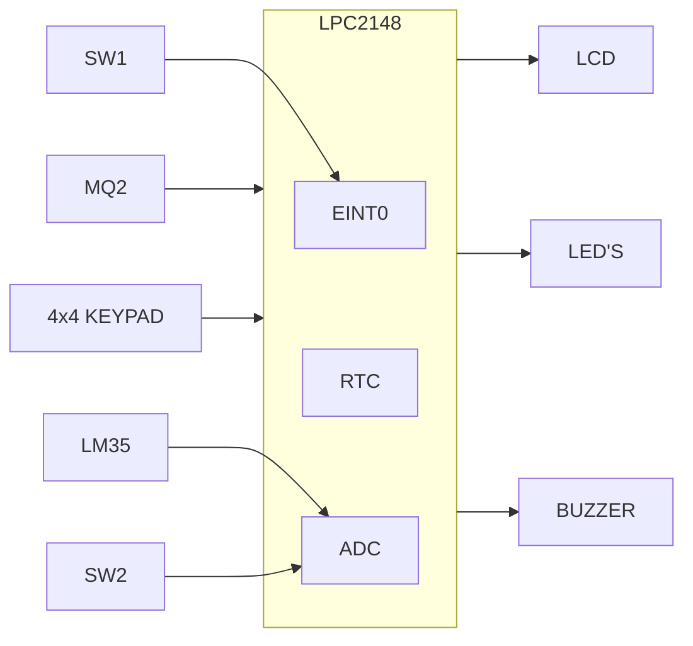
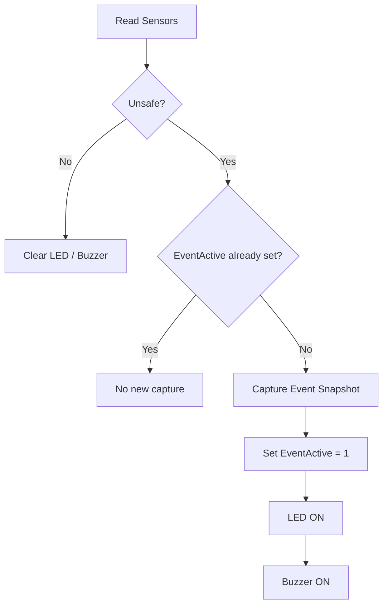
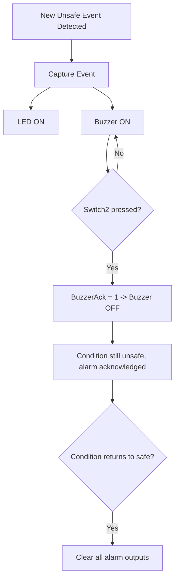
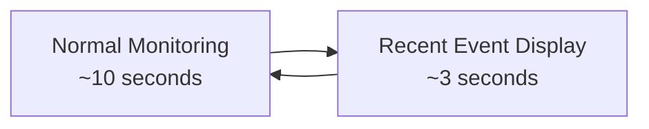
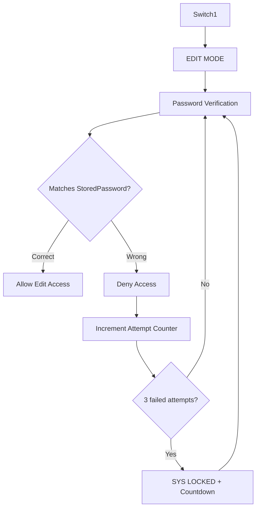
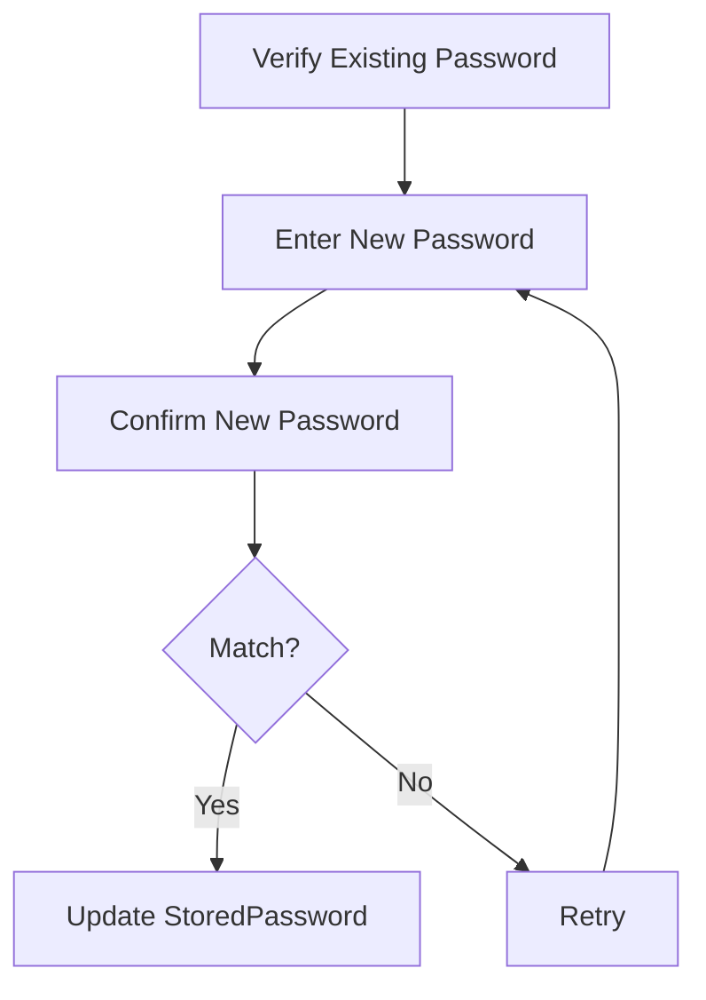
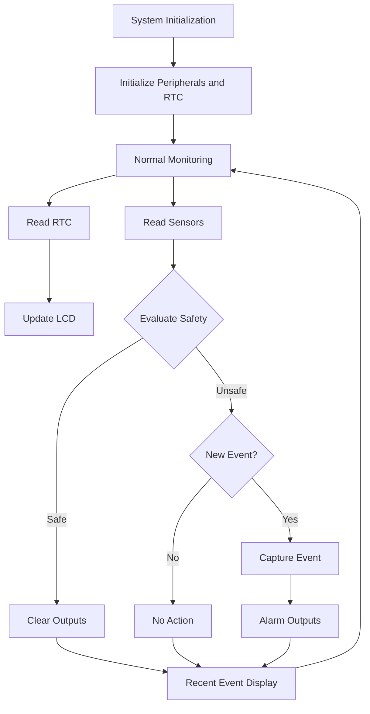

# Kitchen Safety Heat and Gas Monitoring System

[]()
[]()
[]()
[]()

An Embedded-C safety monitoring system built around the **LPC2148** microcontroller. The system continuously monitors kitchen **temperature** (LM35) and **gas status** (MQ2), detects unsafe conditions, drives **LED/buzzer alarms**, captures the most recent safety event with **RTC** information, and periodically displays it on a **16×2 LCD**.

A password-protected **EDIT MODE**, entered via Switch1, lets an authorized user configure RTC values, the temperature threshold, and the system password.

> Click any section below to expand it.

---

<a id="toc"></a>
## Table of Contents

<details>
<summary><b>Expand full contents</b></summary>

- [Features](#features)
- [System Architecture](#system-architecture)
- [Block Diagram](#block-diagram)
- [Hardware Setup](#hardware-setup)
- [Hardware Requirements](#hardware-requirements)
- [Software Requirements](#software-requirements)
- [System Operation](#system-operation)
- [Safety Event Management](#safety-event-management)
- [Alarm Handling](#alarm-handling)
- [LCD Monitoring Cycle](#lcd-monitoring-cycle)
- [EDIT MODE](#edit-mode)
- [Settings Menu](#settings-menu)
- [Keypad Controls](#keypad-controls)
- [Function Reference](#function-reference)
- [Application Flow](#application-flow)
- [Project Structure](#project-structure)
- [Build and Programming](#build-and-programming)
- [Testing Checklist](#testing-checklist)
- [Known Limitations](#known-limitations)
- [Future Enhancements](#future-enhancements)
- [Development Practices](#development-practices)
- [Project Status](#project-status)
- [Author](#author)

</details>

---

<a id="features"></a>
<details>
<summary><h2>Features</h2></summary>

| Category | Capability |
|---|---|
| Sensing | LM35 temperature monitoring, configurable threshold |
| Sensing | MQ2 digital gas-status monitoring |
| Control | LPC2148 internal RTC (time, date, day) |
| Interface | 16×2 LCD, 4×4 matrix keypad |
| Alarm | LED indication, buzzer alarm, buzzer acknowledgement via switch |
| Event handling | `EVENT_TEMP`, `EVENT_GAS`, `EVENT_BOTH` classification, latest-event snapshot, periodic recent-event display |
| Security | Switch1-triggered EDIT MODE, password-protected configuration, 3-attempt lockout, password reset with confirmation |
| Configuration | RTC time/date/day setting, temperature threshold setting |

</details>

---

<a id="system-architecture"></a>
<details>
<summary><h2>System Architecture</h2></summary>



> **Year format note:** the RTC's `YEAR` field is stored and displayed as the **last two digits only** (e.g. `26` for 2026), not the full four-digit year.

</details>

---

<a id="block-diagram"></a>
<details>
<summary><h2>Block Diagram</h2></summary>

Reproduced from the project specification's original block diagram:



- **SW1** drives `EINT0`, the interrupt line that triggers EDIT MODE.
- **MQ2** and the **4x4 KEYPAD** feed directly into the LPC2148.
- **RTC** is internal to the LPC2148 and drives the **LCD**.
- **ADC** (internal) reads **LM35** and **SW2**.
- Outputs: **LCD**, **LED'S**, **BUZZER**.

</details>

---

<a id="hardware-setup"></a>
<details>
<summary><h2>Hardware Setup</h2></summary>

Built on the Vector Advanced Development Board for ARM7 (LPC2148):

- LPC2148 target with on-board RTC crystal and reset/power-supply section
- RS-232/UART module wired in for programming and debug
- 16×2 LCD (`JHD 162A`) in 8-bit mode, `D0`–`D7` wired to the LCD data header, `RS`/`EN` from dedicated control pins
- 4×4 matrix keypad for menu navigation and password/threshold entry
- Active-HIGH switch bank (`SW1`–`SW4`) and Active-LOW switch bank (`SW5`–`SW8`), used for Switch1/Switch2
- LED banks (`LED1`–`LED8`) for safety indication
- On-board buzzer and ADC section for LM35/MQ2 sensor inputs

Refer to the [Block Diagram](#block-diagram) above for how these are logically connected.

</details>

---

<a id="hardware-requirements"></a>
<details>
<summary><h2>Hardware Requirements</h2></summary>

| Component | Purpose |
|---|---|
| LPC2148 | Main embedded controller |
| LM35 | Temperature sensing |
| MQ2 | Gas-status detection |
| 16×2 LCD | Monitoring and configuration display |
| 4×4 Matrix Keypad | Menu navigation and user input |
| RTC | Time, date, and day information |
| LEDs | Visual safety indication |
| Buzzer | Audible safety indication |
| Switch1 | EDIT MODE entry |
| Switch2 | Buzzer acknowledgement |
| USB-UART Converter / DB-9 Cable | Programming / communication interface |

*Based on the supplied project specification.*

</details>

---

<a id="software-requirements"></a>
<details>
<summary><h2>Software Requirements</h2></summary>

- Embedded-C programming
- Keil µVision (Embedded-C development environment)
- Flash Magic (programming tool)
- Proteus (if simulation is used)

</details>

---

<a id="system-operation"></a>
<details>
<summary><h2>System Operation</h2></summary>

### 1. Initialization

The application initializes the required peripherals and enters normal monitoring operation via:

```c
Init_RTC();
```

The main loop then continuously performs RTC reading, sensor monitoring, LCD updates, safety evaluation, and alarm handling.

### 2. Temperature Monitoring

```c
TempLevel  = LM35TempC();
TempUnsafe = (TempLevel > TEMP_THRESHOLD);
```

Default: `TEMP_THRESHOLD = 40`. Editable through the protected settings menu.

### 3. Gas Monitoring

```c
GasLevel = GetGasStatus();
```

The current implementation reads the MQ2 as a **digital gas-status input** rather than calculating a calibrated ppm concentration. This is intentional: the supplied specification describes MQ2 gas-leakage *detection*, and the active source implements digital status monitoring for that purpose.

</details>

---

<a id="safety-event-management"></a>
<details>
<summary><h2>Safety Event Management</h2></summary>

The application tracks:

- `TempUnsafe`, `GasUnsafe` — live per-sensor safety state
- `EventActive` — whether an unsafe condition is currently active
- `EventType` — classification of the active/last event

An unsafe condition exists whenever **either** monitored condition is unsafe. A new event is captured only on the **transition** into an active unsafe state (not on every loop pass while it persists).

### Event Types

| Event | Meaning |
|---|---|
| `EVENT_TEMP` | Temperature is unsafe |
| `EVENT_GAS` | Gas condition is unsafe |
| `EVENT_BOTH` | Temperature and gas are both unsafe |

### Event Snapshot

| Field | Captures |
|---|---|
| `Timestamp` | Event time |
| `Datestamp` | Event date |
| `stamp_day` | Event weekday |
| `stamp_temp` | Temperature at event |
| `stamp_gas` | Gas status at event |
| `EventType` | Event category |

The implementation retains only the **most recent** event — there is no multi-event history or database.



**Sample LCD output — normal monitoring vs. an unsafe temperature event:**

```
┌──────────────────┐    ┌──────────────────┐
│12:14:29 SAT70C   │    │UNSAFE            │
│25/09/26          │    │TEMP IS HIGH      │
└──────────────────┘    └──────────────────┘
```

**Sample LCD output — normal monitoring vs. an unsafe gas event:**

```
┌──────────────────┐    ┌──────────────────┐
│13:00:40 SAT44C   │    │UNSAFE            │
│25/09/26 GAS:0    │    │GAS IS HIGH       │
└──────────────────┘    └──────────────────┘
```

**Sample LCD output — recent-event screen after a gas event, then back to normal:**

```
┌──────────────────┐    ┌──────────────────┐
│12:15:24 SAT      │    │13:01:43 SAT43C   │
│25/09/26 GAS:1    │    │25/09/26 GAS:0    │
└──────────────────┘    └──────────────────┘
```

</details>

---

<a id="alarm-handling"></a>
<details>
<summary><h2>Alarm Handling</h2></summary>



**Important:** acknowledging the buzzer via Switch2 does **not** mean the unsafe condition has cleared — it only silences the active alarm. Outputs are cleared automatically once the monitored condition returns to a safe state.

</details>

---

<a id="lcd-monitoring-cycle"></a>
<details>
<summary><h2>LCD Monitoring Cycle</h2></summary>

The normal monitoring screen presents:

- Current time
- Current date
- Day of week
- Current temperature
- Current gas status

Managed by `DisplayEvent()`, cycling as:



*The project specification describes a 10-second monitoring interval followed by ~2–3 seconds of recent-event display.*

</details>

---

<a id="edit-mode"></a>
<details>
<summary><h2>EDIT MODE</h2></summary>



**Sample LCD output — first-boot setup vs. later authentication:**

```
┌──────────────────┐    ┌──────────────────┐
│SET PASSWORD      │    │ENTER             │
│----              │    │PASSWORD ****     │
└──────────────────┘    └──────────────────┘
```

**Sample LCD output — a wrong attempt vs. the lockout after the third failure:**

```
┌──────────────────┐    ┌──────────────────┐
│PASSWORD NOT      │    │ACCESS DENIED     │
│MATCH             │    │SYS LOCKED 10s    │
└──────────────────┘    └──────────────────┘
```

### Password Input

`ReadPassword()` supports:

- Keypad input
- Password masking (`*`)
- Clear (`c`)
- Delete previous digit (`-`)
- Confirmation (`=`)
- Maximum length via `MAX_PWD_LEN`

> The password function uses a **static internal buffer**. Code that needs to retain the returned password must copy it before the next password read reuses the buffer.

</details>

---

<a id="settings-menu"></a>
<details>
<summary><h2>Settings Menu</h2></summary>

After successful authentication, `Setting()` manages the protected configuration menu.

```
1. SetRTC
2. SetP        (Temperature threshold)
3. RsetP       (Reset password)
4. EXIT
```

**SetRTC**
```
1. SETTIME  -> 1.HOUR  2.MIN  3.SEC  4.BACK
2. SetDate  -> 1.DOM   2.MON  3.YEAR 4.BACK
3. SetD     (Day of week)
4. Back
```

**Sample LCD output — top-level menu, SetRTC submenu, and the HOUR/MIN/SEC submenu:**

```
┌──────────────────┐  ┌──────────────────┐  ┌──────────────────┐
│1.SetRTC 3.RsetP  │  │1.SETTIME 3.SetD  │  │1.HOUR   3.SEC    │
│2.SetP   4.EXIT   │  │2.SetDate 4.Back  │  │2.MIN    4.BACK   │
└──────────────────┘  └──────────────────┘  └──────────────────┘
```

**Sample LCD output — hour and minute entry, each followed by its confirmation:**

```
┌──────────────────┐  ┌──────────────────┐  ┌──────────────────┐  ┌──────────────────┐
│SET HOUR          │  │HOUR SET          │  │SET MIN           │  │MIN SET           │
│12                │  │                  │  │10                │  │                  │
└──────────────────┘  └──────────────────┘  └──────────────────┘  └──────────────────┘
```

**Sample LCD output — date submenu, then day-of-month and month entry with confirmation:**

```
┌──────────────────┐  ┌──────────────────┐  ┌──────────────────┐  ┌──────────────────┐
│1.DOM    3.YEAR   │  │SET DOM           │  │SET MONTH         │  │MONTH SET         │
│2.MON    4.BACK   │  │25                │  │09                │  │                  │
└──────────────────┘  └──────────────────┘  └──────────────────┘  └──────────────────┘
```

**Sample LCD output — year entry and confirmation, completing the date fields:**

```
┌──────────────────┐    ┌──────────────────┐
│SET YEAR          │    │YEAR SET          │
│26                │    │                  │
└──────────────────┘    └──────────────────┘
```

The year is entered and stored as its **last two digits only** (e.g. `26` for 2026).

### Field Validation

| Parameter | Range |
|---|---|
| Hour | 00–23 |
| Minute | 00–59 |
| Second | 00–59 |
| Day of Month | 01–31 |
| Month | 01–12 |
| Year | 00–99 (last two digits of the year) |

Day of week: `0=SUN 1=MON 2=TUE 3=WED 4=THU 5=FRI 6=SAT`

> Individual fields are validated, but month-specific day counts and leap-year validation are **not** currently implemented.

### Temperature Threshold Configuration

Handled by `SetThreshold()` — supports digit entry, delete-previous-digit, clear, and confirm. Result is stored in `TEMP_THRESHOLD`.

**Sample LCD output — threshold prompt, digit entry, and confirmation:**

```
┌──────────────────┐  ┌──────────────────┐  ┌──────────────────┐
│SET TEMP LIMIT    │  │SET TEMP LIMIT    │  │TEMP LIMIT SET    │
│                  │  │68                │  │68                │
└──────────────────┘  └──────────────────┘  └──────────────────┘
```

### Password Reset



**Sample LCD output — reset entry, confirmation entry, and completion:**

```
┌──────────────────┐  ┌──────────────────┐  ┌──────────────────┐
│RESET PASSWORD    │  │CONFIRM           │  │PASSWORD          │
│                  │  │PASSWORD          │  │RESET             │
└──────────────────┘  └──────────────────┘  └──────────────────┘
```

</details>

---

<a id="keypad-controls"></a>
<details>
<summary><h2>Keypad Controls</h2></summary>

| Key | Purpose |
|---|---|
| `0`–`9` | Numeric input / menu selection |
| `=` | Confirm |
| `c` | Clear |
| `-` | Delete previous digit |

Matrix scanning is handled by `keyscan()`.

</details>

---

<a id="function-reference"></a>
<details>
<summary><h2>Function Reference</h2></summary>

### RTC

| Function | Responsibility |
|---|---|
| `Init_RTC()` | Initialize RTC |
| `GetRTCTime()` | Read RTC time |
| `DisplayRTCTime()` | Display RTC time |
| `GetRTCDate()` | Read RTC date |
| `DisplayRTCDate()` | Display RTC date |
| `GetRTCDay()` | Read day-of-week |
| `DisplayRTCDay()` | Display weekday |

### Application

| Function | Responsibility |
|---|---|
| `ReadPassword()` | Read and mask password input |
| `VerifyPassword()` | Authenticate user, handle lockout |
| `GetGasStatus()` | Read digital gas status |
| `DisplaySensorReading()` | Display live sensor values, process safety events |
| `DisplayEvent()` | Manage monitoring / recent-event display cycle |
| `SetThreshold()` | Read temperature threshold input |
| `RTC_SetValue()` | Read RTC configuration fields |
| `Setting()` | Manage protected configuration menu |

</details>

---

<a id="application-flow"></a>
<details>
<summary><h2>Application Flow</h2></summary>



</details>

---

<a id="project-structure"></a>
<details>
<summary><h2>Project Structure</h2></summary>

```
Kitchen-Safety-Heat-Gas-Monitoring/
│
├── README.md
│
├── src/
│   ├── main.c
│   └── application source files
│
├── inc/
│   └── project header files
│
├── docs/
│   └── project-specification.pdf
│
├── proteus/
│   └── simulation files
│
└── keil/
    └── Keil project files
```

> Keep this section synchronized with the actual repository — do not create directories only to match this example.

</details>

---

<a id="build-and-programming"></a>
<details>
<summary><h2>Build and Programming</h2></summary>

### Keil µVision

1. Open the project in Keil µVision.
2. Select the **LPC2148** target.
3. Verify all required source and header files are included.
4. Verify the device/startup configuration.
5. Build the project and resolve any compiler/linker errors.
6. Generate the `.hex` output.

### Flash Magic

1. Connect the LPC2148 via the supported programming interface.
2. Select the correct device.
3. Select the generated `.hex` file.
4. Configure the appropriate communication settings.
5. Program the controller and reset the target.
6. Verify LCD, sensors, keypad, RTC, LED, buzzer, and switches.

> Exact Flash Magic communication settings and pin configuration should match the actual hardware setup used for the project.

</details>

---

<a id="testing-checklist"></a>
<details>
<summary><h2>Testing Checklist</h2></summary>

**RTC** — initialization · hour/min/sec display · date/month/year display · day-of-week display · time range validation · date field validation · day range validation

**Temperature** — LM35 reading · display · threshold configuration · unsafe detection · LED activation · buzzer activation · event capture

**Gas** — MQ2 digital input · status display · event detection · LED activation · buzzer activation · event capture

**Event Handling** — `EVENT_TEMP` · `EVENT_GAS` · `EVENT_BOTH` · timestamp/date/weekday capture · temperature/gas snapshot · recent-event display · return to monitoring

**Password / EDIT MODE** — Switch1 entry · password prompt · correct/incorrect password · 3-attempt lockout · lockout countdown · masking · reset · confirmation · RTC editing · threshold editing · exit to monitoring

**Alarm** — buzzer activation · LED activation · buzzer acknowledgement · new-event acknowledgement · output clearing after safe condition

</details>

---

<a id="known-limitations"></a>
<details>
<summary><h2>Known Limitations</h2></summary>

- **Gas sensing is digital, not analog** — the MQ2 is currently read as a simple safe/unsafe digital status line rather than through the ADC, so the system reports *whether* gas is present, not a calibrated concentration in ppm.
- **Gas threshold configuration** — not active in the current build.
- **Event history** — only the latest event snapshot is retained.
- **Calendar validation** — individual fields validated; no month/day/leap-year cross-validation.
- **Year representation** — the RTC stores and displays only the last two digits of the year (`00`–`99`), not the full four-digit year.
- **Configuration persistence** — not guaranteed across power cycles unless explicitly implemented in the active flow.
- **Safety certification** — this is a prototype/student project, not a certified safety-critical system.

</details>

---

<a id="future-enhancements"></a>
<details>
<summary><h2>Future Enhancements</h2></summary>

- Analog, calibrated MQ2 gas concentration measurement (ppm) via ADC
- Configurable gas threshold
- Persistent configuration storage (IAP/EEPROM)
- Complete calendar validation (leap years, month-day limits)
- Multiple-event history/logging
- Sensor fault detection
- Hardware abstraction layer for drivers
- Centralized configuration structure
- Automated test coverage

</details>

---

<a id="development-practices"></a>
<details>
<summary><h2>Development Practices</h2></summary>

Per the supplied specification, this project follows:

- Proper code structure and naming conventions
- Modular design with dedicated responsibilities (RTC, authentication, sensor monitoring, event processing, threshold input, settings management)
- Minimal global state where practical
- Hardware abstraction where practical
- Repeatable build instructions
- Documentation that reflects the actual implementation

</details>

---

<a id="project-status"></a>
<details>
<summary><h2>Project Status</h2></summary>

| | |
|---|---|
| Status | Embedded project / prototype |
| Target MCU | LPC2148 |
| Language | Embedded C |
| IDE | Keil µVision |
| Programmer | Flash Magic |
| Interface | 16×2 LCD + 4×4 Matrix Keypad |
| Sensors | LM35 + MQ2 |
| Monitoring | Temperature + digital gas status |
| Event Storage | Most recent safety event only |
| Configuration | Password-protected EDIT MODE |

</details>

---

<a id="author"></a>
<details>
<summary><h2>Author</h2></summary>

**Koteswar Rao Golagani (Hari)**

</details>
