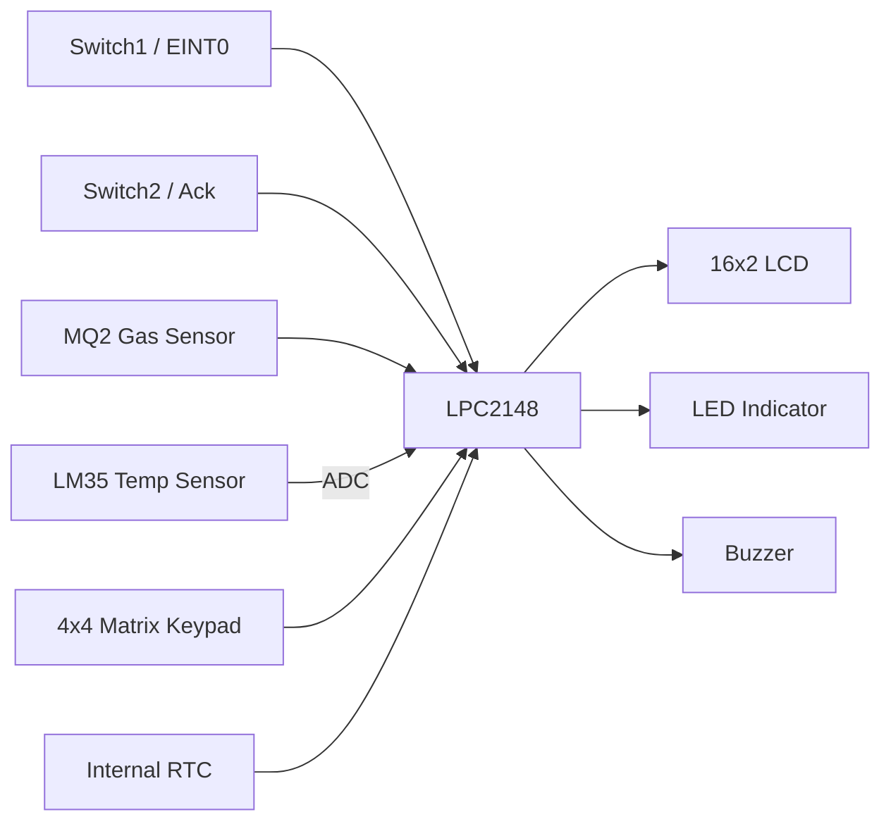
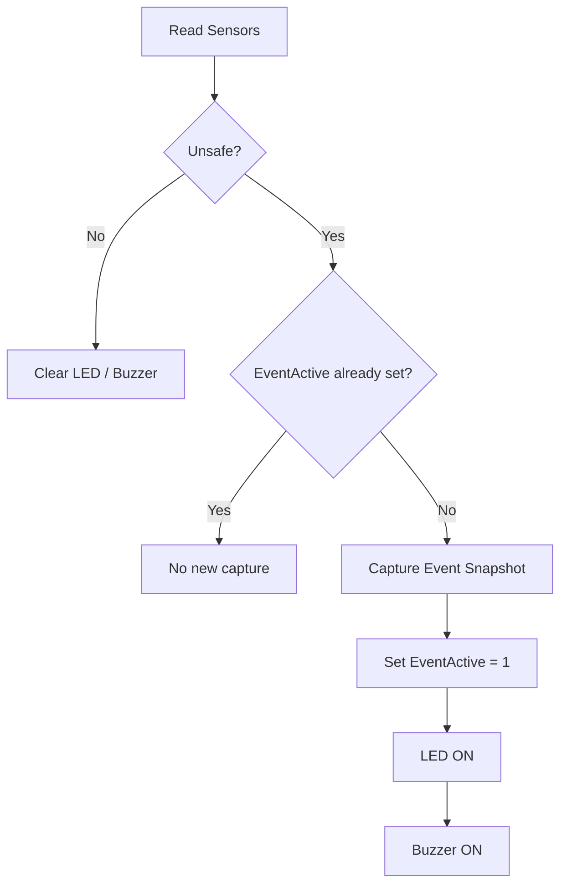
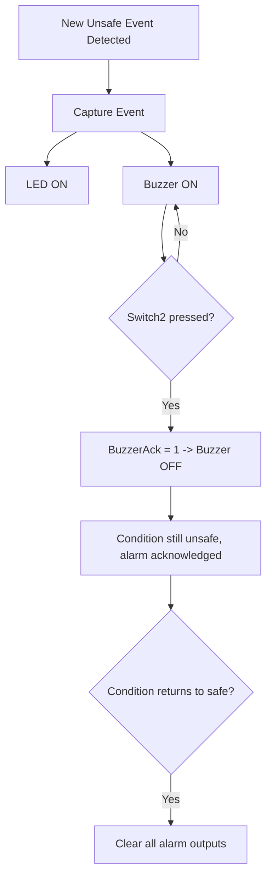
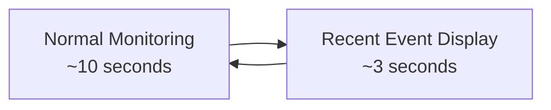
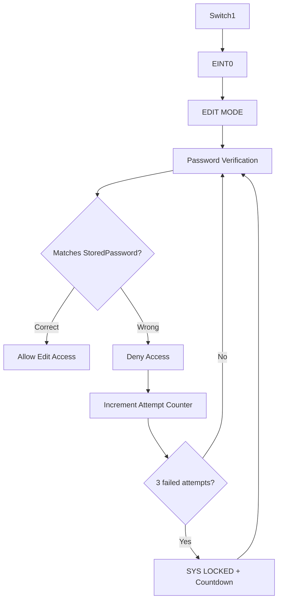
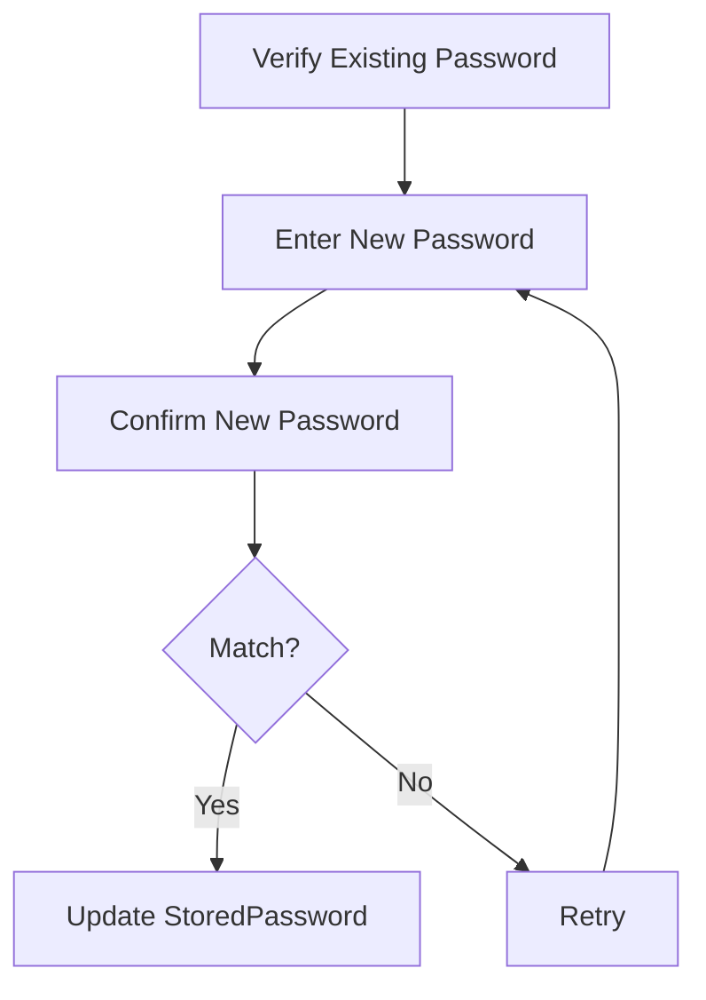
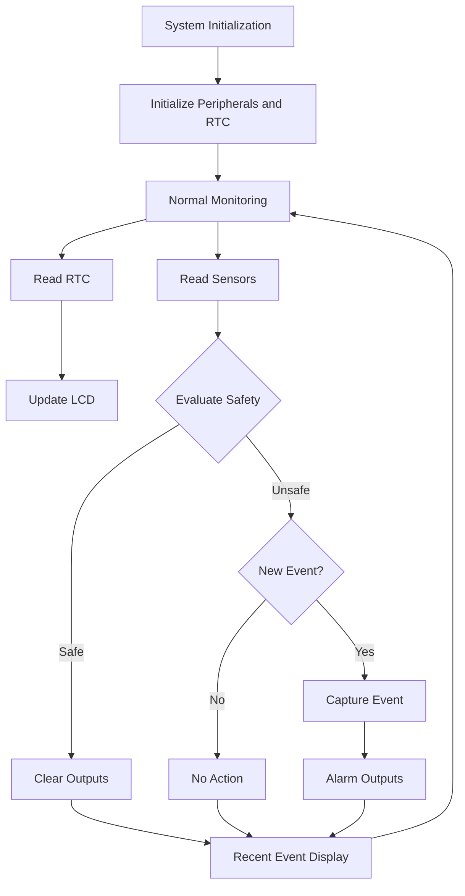

# Kitchen Safety Heat and Gas Monitoring System

[]()
[]()
[]()
[]()

An Embedded-C safety monitoring system built around the **LPC2148** microcontroller. The system continuously monitors kitchen **temperature** (LM35) and **gas status** (MQ2), detects unsafe conditions, drives **LED/buzzer alarms**, captures the most recent safety event with **RTC** information, and periodically displays it on a **16×2 LCD**.

A password-protected **EDIT MODE**, entered via `EINT0` (Switch1), lets an authorized user configure RTC values, the temperature threshold, and the system password.

---

## Table of Contents

- [Features](#features)
- [System Architecture](#system-architecture)
- [Hardware Requirements](#hardware-requirements)
- [Software Requirements](#software-requirements)
- [System Operation](#system-operation)
- [Safety Event Management](#safety-event-management)
- [Alarm Handling](#alarm-handling)
- [LCD Monitoring Cycle](#lcd-monitoring-cycle)
- [EDIT MODE](#edit-mode)
- [Settings Menu](#settings-menu)
- [Keypad Controls](#keypad-controls)
- [Function Reference](#function-reference)
- [Application Flow](#application-flow)
- [Project Structure](#project-structure)
- [Build and Programming](#build-and-programming)
- [Testing Checklist](#testing-checklist)
- [Known Limitations](#known-limitations)
- [Future Enhancements](#future-enhancements)
- [Development Practices](#development-practices)
- [Project Status](#project-status)
- [Author](#author)

---

## Features

| Category | Capability |
|---|---|
| Sensing | LM35 temperature monitoring, configurable threshold |
| Sensing | MQ2 digital gas-status monitoring |
| Control | LPC2148 internal RTC (time, date, day) |
| Interface | 16×2 LCD, 4×4 matrix keypad |
| Alarm | LED indication, buzzer alarm, buzzer acknowledgement via switch |
| Event handling | `EVENT_TEMP`, `EVENT_GAS`, `EVENT_BOTH` classification, latest-event snapshot, periodic recent-event display |
| Security | `EINT0`-triggered EDIT MODE, password-protected configuration, 3-attempt lockout, password reset with confirmation |
| Configuration | RTC time/date/day setting, temperature threshold setting |

> **Implementation note:** The current source treats the MQ2 as a **digital gas-status input**. It does not implement calibrated gas concentration measurement in ppm.

---

## System Architecture



This architecture follows the supplied project block diagram.

---

## Hardware Requirements

| Component | Purpose |
|---|---|
| LPC2148 | Main embedded controller |
| LM35 | Temperature sensing |
| MQ2 | Gas-status detection |
| 16×2 LCD | Monitoring and configuration display |
| 4×4 Matrix Keypad | Menu navigation and user input |
| RTC | Time, date, and day information |
| LEDs | Visual safety indication |
| Buzzer | Audible safety indication |
| Switch1 | `EINT0` / EDIT MODE entry |
| Switch2 | Buzzer acknowledgement |
| USB-UART Converter / DB-9 Cable | Programming / communication interface |

*Based on the supplied project specification.*

## Software Requirements

- Embedded-C programming
- Keil µVision (Embedded-C development environment)
- Flash Magic (programming tool)
- Proteus (if simulation is used)

---

## System Operation

### 1. Initialization

The application initializes the required peripherals and enters normal monitoring operation via:

```c
Init_RTC();
```

The main loop then continuously performs RTC reading, sensor monitoring, LCD updates, safety evaluation, and alarm handling.

### 2. Temperature Monitoring

```c
TempLevel  = LM35TempC();
TempUnsafe = (TempLevel > TEMP_THRESHOLD);
```

Default: `TEMP_THRESHOLD = 40`. Editable through the protected settings menu.

### 3. Gas Monitoring

```c
GasLevel = GetGasStatus();
```

The current implementation reads the MQ2 as a **digital gas-status input** rather than calculating a calibrated ppm concentration. This is intentional: the supplied specification describes MQ2 gas-leakage *detection*, and the active source implements digital status monitoring for that purpose.

---

## Safety Event Management

The application tracks:

- `TempUnsafe`, `GasUnsafe` — live per-sensor safety state
- `EventActive` — whether an unsafe condition is currently active
- `EventType` — classification of the active/last event

An unsafe condition exists whenever **either** monitored condition is unsafe. A new event is captured only on the **transition** into an active unsafe state (not on every loop pass while it persists).

### Event Types

| Event | Meaning |
|---|---|
| `EVENT_TEMP` | Temperature is unsafe |
| `EVENT_GAS` | Gas condition is unsafe |
| `EVENT_BOTH` | Temperature and gas are both unsafe |

### Event Snapshot

| Field | Captures |
|---|---|
| `Timestamp` | Event time |
| `Datestamp` | Event date |
| `stamp_day` | Event weekday |
| `stamp_temp` | Temperature at event |
| `stamp_gas` | Gas status at event |
| `EventType` | Event category |

The implementation retains only the **most recent** event — there is no multi-event history or database.



---

## Alarm Handling



**Important:** acknowledging the buzzer via Switch2 does **not** mean the unsafe condition has cleared — it only silences the active alarm. Outputs are cleared automatically once the monitored condition returns to a safe state.

---

## LCD Monitoring Cycle

The normal monitoring screen presents:

- Current time
- Current date
- Day of week
- Current temperature
- Current gas status

Managed by `DisplayEvent()`, cycling as:



*The project specification describes a 10-second monitoring interval followed by ~2–3 seconds of recent-event display.*

---

## EDIT MODE



### Password Input

`ReadPassword()` supports:

- Keypad input
- Password masking (`*`)
- Clear (`c`)
- Delete previous digit (`-`)
- Confirmation (`=`)
- Maximum length via `MAX_PWD_LEN`

> The password function uses a **static internal buffer**. Code that needs to retain the returned password must copy it before the next password read reuses the buffer.

---

## Settings Menu

After successful authentication, `Setting()` manages the protected configuration menu.

```
1. SetRTC
2. SetP        (Temperature threshold)
3. RsetP       (Reset password)
4. EXIT
```

**SetRTC**
```
1. SETTIME  -> 1.HOUR  2.MIN  3.SEC  4.BACK
2. SetDate  -> 1.DOM   2.MON  3.YEAR 4.BACK
3. SetD     (Day of week)
4. Back
```

### Field Validation

| Parameter | Range |
|---|---|
| Hour | 00–23 |
| Minute | 00–59 |
| Second | 00–59 |
| Day of Month | 01–31 |
| Month | 01–12 |
| Year | 00–99 |

Day of week: `0=SUN 1=MON 2=TUE 3=WED 4=THU 5=FRI 6=SAT`

> Individual fields are validated, but month-specific day counts and leap-year validation are **not** currently implemented.

### Temperature Threshold Configuration

Handled by `SetThreshold()` — supports digit entry, delete-previous-digit, clear, and confirm. Result is stored in `TEMP_THRESHOLD`.

### Password Reset



---

## Keypad Controls

| Key | Purpose |
|---|---|
| `0`–`9` | Numeric input / menu selection |
| `=` | Confirm |
| `c` | Clear |
| `-` | Delete previous digit |

Matrix scanning is handled by `keyscan()`.

---

## Function Reference

### RTC

| Function | Responsibility |
|---|---|
| `Init_RTC()` | Initialize RTC |
| `GetRTCTime()` | Read RTC time |
| `DisplayRTCTime()` | Display RTC time |
| `GetRTCDate()` | Read RTC date |
| `DisplayRTCDate()` | Display RTC date |
| `GetRTCDay()` | Read day-of-week |
| `DisplayRTCDay()` | Display weekday |

### Application

| Function | Responsibility |
|---|---|
| `ReadPassword()` | Read and mask password input |
| `VerifyPassword()` | Authenticate user, handle lockout |
| `GetGasStatus()` | Read digital gas status |
| `DisplaySensorReading()` | Display live sensor values, process safety events |
| `DisplayEvent()` | Manage monitoring / recent-event display cycle |
| `SetThreshold()` | Read temperature threshold input |
| `RTC_SetValue()` | Read RTC configuration fields |
| `Setting()` | Manage protected configuration menu |

---

## Application Flow



---

## Project Structure

```
Kitchen-Safety-Heat-Gas-Monitoring/
│
├── README.md
│
├── src/
│   ├── main.c
│   └── application source files
│
├── inc/
│   └── project header files
│
├── docs/
│   ├── project-specification.pdf
│   └── images/
│
├── proteus/
│   └── simulation files
│
└── keil/
    └── Keil project files
```

> Keep this section synchronized with the actual repository — do not create directories only to match this example.

---

## Build and Programming

### Keil µVision

1. Open the project in Keil µVision.
2. Select the **LPC2148** target.
3. Verify all required source and header files are included.
4. Verify the device/startup configuration.
5. Build the project and resolve any compiler/linker errors.
6. Generate the `.hex` output.

### Flash Magic

1. Connect the LPC2148 via the supported programming interface.
2. Select the correct device.
3. Select the generated `.hex` file.
4. Configure the appropriate communication settings.
5. Program the controller and reset the target.
6. Verify LCD, sensors, keypad, RTC, LED, buzzer, and switches.

> Exact Flash Magic communication settings and pin configuration should match the actual hardware setup used for the project.

---

## Testing Checklist

**RTC** — initialization · hour/min/sec display · date/month/year display · day-of-week display · time range validation · date field validation · day range validation

**Temperature** — LM35 reading · display · threshold configuration · unsafe detection · LED activation · buzzer activation · event capture

**Gas** — MQ2 digital input · status display · event detection · LED activation · buzzer activation · event capture

**Event Handling** — `EVENT_TEMP` · `EVENT_GAS` · `EVENT_BOTH` · timestamp/date/weekday capture · temperature/gas snapshot · recent-event display · return to monitoring

**Password / EDIT MODE** — Switch1/EINT0 entry · password prompt · correct/incorrect password · 3-attempt lockout · lockout countdown · masking · reset · confirmation · RTC editing · threshold editing · exit to monitoring

**Alarm** — buzzer activation · LED activation · buzzer acknowledgement · new-event acknowledgement · output clearing after safe condition

---

## Known Limitations

- **MQ2 measurement** — digital gas status only; no calibrated ppm calculation.
- **Gas threshold configuration** — not active in the current build.
- **Event history** — only the latest event snapshot is retained.
- **Calendar validation** — individual fields validated; no month/day/leap-year cross-validation.
- **Configuration persistence** — not guaranteed across power cycles unless explicitly implemented in the active flow.
- **Safety certification** — this is a prototype/student project, not a certified safety-critical system.

## Future Enhancements

- Calibrated MQ2 gas concentration measurement (ppm)
- Configurable gas threshold
- Persistent configuration storage (IAP/EEPROM)
- Complete calendar validation (leap years, month-day limits)
- Multiple-event history/logging
- Sensor fault detection
- Hardware abstraction layer for drivers
- Centralized configuration structure
- Automated test coverage

---

## Development Practices

Per the supplied specification, this project follows:

- Proper code structure and naming conventions
- Modular design with dedicated responsibilities (RTC, authentication, sensor monitoring, event processing, threshold input, settings management)
- Minimal global state where practical
- Hardware abstraction where practical
- Repeatable build instructions
- Documentation that reflects the actual implementation

---

## Project Status

| | |
|---|---|
| Status | Embedded project / prototype |
| Target MCU | LPC2148 |
| Language | Embedded C |
| IDE | Keil µVision |
| Programmer | Flash Magic |
| Interface | 16×2 LCD + 4×4 Matrix Keypad |
| Sensors | LM35 + MQ2 |
| Monitoring | Temperature + digital gas status |
| Event Storage | Most recent safety event only |
| Configuration | Password-protected EDIT MODE |

## Author

**Koteswar Rao Golagani**
